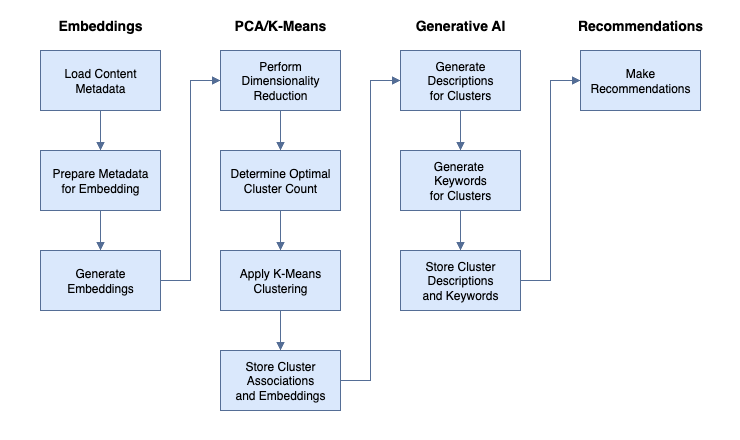

# Building Smarter Content Recommendations with PCA, K-Means, and Generative AI

## How Embeddings, Clustering, and Generative AI-Driven Labeling Reveal Semantic Relationships Between Streaming Titles

This project demonstrates an approach to video content recommendations using machine learning and Generative AI. By analyzing semantic relationships rather than just metadata tags, this technique offers an effective solution for content recommendation.

## Key Features

- **Data Analysis:** Examines metadata from 150 recent streaming titles to identify content similarities and relationships
- **Semantic Vectorization:** Transforms content's metadata into dense vector embeddings using a text embedding model
- **Dimensional Analysis:** Employs Principal Component Analysis (PCA) for dimensionality reduction and K-Means for cluster identification
- **Visual Representation:** Creates interactive 2D scatter plots to visualize content relationships and clustering patterns
- **AI-Powered Insights:** Leverages Generative AI to produce natural language descriptions of each content cluster and extract meaningful keywords

This approach enables content platforms to automatically group similar videos based on deep semantic connections rather than superficial categorization, significantly enhancing recommendation accuracy and content discovery.

## Workflow Diagram



## Setup for Ollama

```bash
ollama pull qwen3-embedding:4b
ollama pull gpt-oss:20b
```

```bash
python -m pip install virtualenv --break-system-packages -Uq
python -m venv .venv
source .venv/bin/activate

python -m pip install pip -Uq
python -m pip install -r requirements_ollama.txt -Uq
```

## Setup for Amazon Bedrock

```bash
cp env.txt .env # update file after copying
```

```bash
python -m pip install virtualenv --break-system-packages -Uq
python -m venv .venv
source .venv/bin/activate

python -m pip install pip -Uq
python -m pip install -r requirements_bedrock.txt -Uq
```
